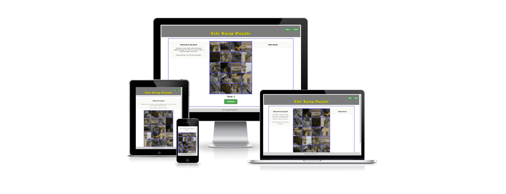

# TILE SWAP PUZZLE.

## Welcome to my page! 

Header

## Features

- **Home Page** 
    * **Sections in the page** 

- **Game main board** 

- **Navigation bar**
 
- **Footer.** 

## Technologies used:
  - Javascript
  - HTML5
  - CSS3
  - Gitpod
  - GitHub

## Testing
Every page in this project was validation tested and it is responsive for every type of devices from desktop computers to mobile phone screen.
More details about tesings are available in the separate testing section [here](documentation/TESTING.md) or in the dedicated directory documentation/TESTING.md

## Deployment

The site was deployed to GitHub pages. The steps to deploy are as follows: 
  - In the [GitHub repository](https://github.com/TomaszWoloszyn983/swap-puzzle-game), navigate to the Settings tab 
  - From the source section drop-down menu, select the **Main** Branch, then click "Save".
  - The page will be automatically refreshed with a detailed ribbon display to indicate the successful deployment.

The live link can be found [here](https://github.com/TomaszWoloszyn983/swap-puzzle-game)

### Local Deployment

In order to make a local copy of this project, you can clone it. In your IDE Terminal, type the following command to clone my repository:

- `git clone https://github.com/TomaszWoloszyn983/swap-puzzle-game.git`

Alternatively, if using Gitpod, you can click below to create your own workspace using this repository.

## Credits

