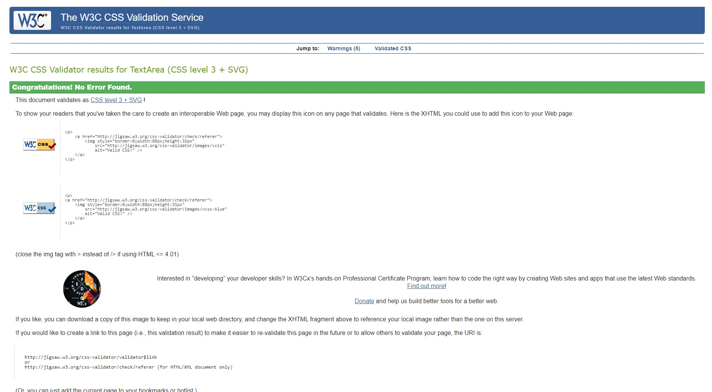
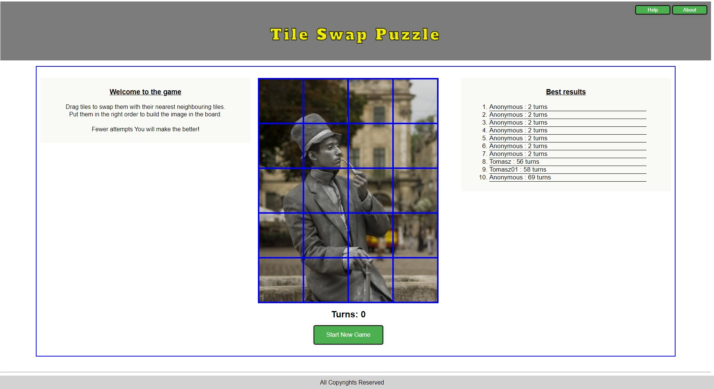
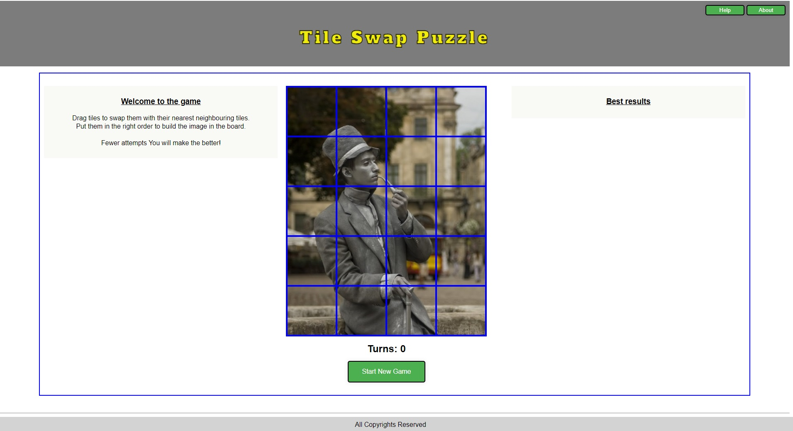
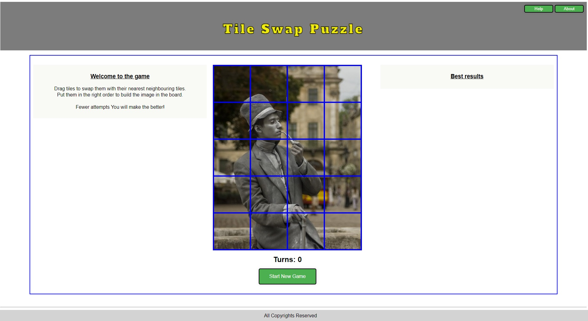

**Responsiveness**
- The project was responsive tested on https://ui.dev/amiresponsive and it is responsive for every type of devices such as desktop computers, laptops, tablets and smart phones.

## **Validator Testing**
- HTML
    * No errors were detected when passing through the [W3C validator](https://validator.w3.org/nu/).
    .
    * Link to the validation testing for my Html file:
    https://tomaszwoloszyn983.github.io/swap-puzzle-game/index.html

- CSS
    * No errors were detected when passing through the [jigsaw.w3 validator](https://jigsaw.w3.org/css-validator). 

         
    
    Link to the test
         https://jigsaw.w3.org/css-validator/validator?uri=https%3A%2F%2Ftomaszwoloszyn983.github.io%2Fswap-puzzle-game

- JAVASCRIPT
    * https://beautifytools.com/javascript-validator.php

## **Browsers compatibility**
- The Web Page is compatibile with every tested browser, such as:
    * Google Chrome:

         

    * Microsoft Edge: 
    
       

    * Avast Browser: 

        

    * Netbox Browser:

        

- It si also compatibile with smart phone browsers
    * Mobile phone Google Chrome Browser 

## *There are no unfixed bugs that I am aware of.