# Tile Swap Puzzle.

## Live Application

Link to the Swap Puzzle Game v2 [Here](https://swap-puzzle-game-2.onrender.com)

## Project Overview 

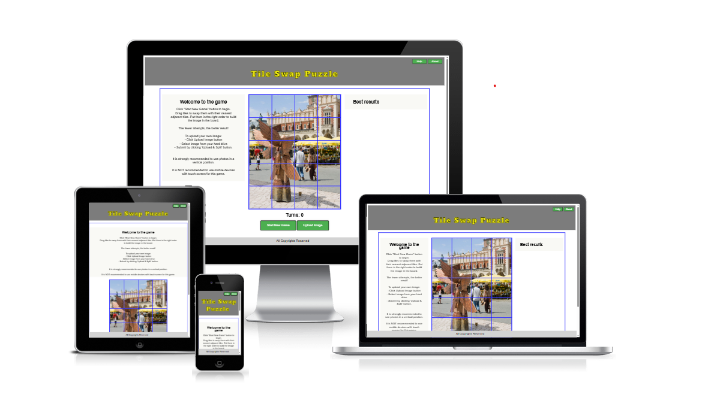

Tile Swap Puzzle is a full-stack web application that allows users to play a drag-and-drop tile puzzle game and dynamically generate new puzzles by uploading their own images.

The game involves assembling the correct picture from jumbled puzzle pieces. Players receive points (tokens) based on how quickly they solve the puzzle. The fewer moves they have to make to solve the puzzle, the more points they earn. After collecting at least 100 points, players can exchange these tokens for NFT Tokens.

The application evolved from a front-end game into a production-ready full-stack project with:
- Server-side image processing
- Dynamic asset generation
- Cloud deployment
- Persistent client-side ranking system
- Modal-based UI architecture

This project demonstrates practical experience with JavaScript frontend, and Java with Spring framework for backend. It includes both client and server environments, asynchronous programming, file system management, and production debugging.

---

## Content

Project contains the following sections:

- [Architecture](#architecture)
- [Features](#features)
- [Collecting Tokens](#collecting-tokens)
- [Claiming Rewards](#claiming-reward)
- [Connecting Wallet](#connecting-wallet)
- [Smart Contract Implementation](#smart-contract-implementation-in-remix)
- [Database](#database)
- [Data Flow](#data-flow)
- [Future Features](#future-features)
- [Technologies Used](#technologies-used)
- [Testing](#testing)
- [Deployment](#deployment)
- [References and Credits](#references-and-credits)


## Architecture

```
Frontend (game)
      ↓
Spring Boot backend
      ↓
PostgreSQL (wallet balance)
      ↓
[CLAIM BUTTON]
      ↓
Blockchain (NFT mint)
```

---

## Features
The project includes only one main page, divided into three main sections:
- **Header** 
Where the name of the project is displayed.
Header section also encloses the navigation bar that constains two buttons.

* **Claim Reward popup box**


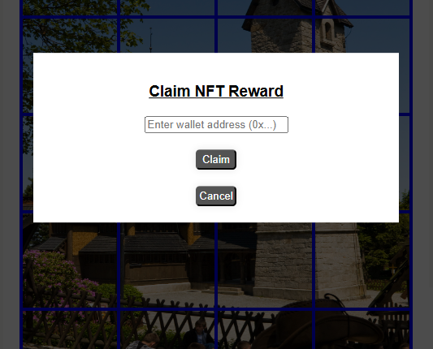

[Code Snippets](codesnippets.md#get-reward-popup-box)

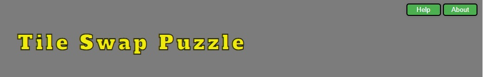

  * **Help** Clicking the Help button displays Popup box that contains more specific information about the rules of the game.

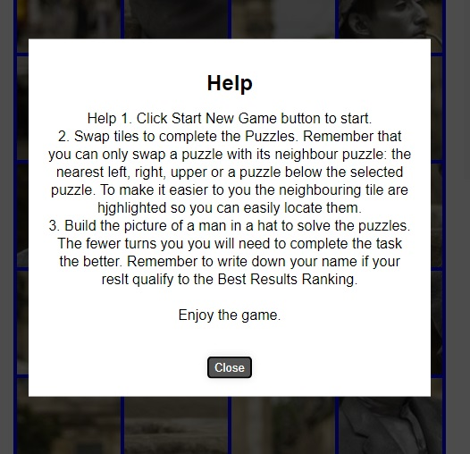

  * **About** About section contains some information about version of the program and how to contact the author.

- **Side bars** 
* **Greeting bar** Displays greeting and brief introduction to the game and its rules.
* **Best Results** List of the best results that were achived by players. It is sorted and displayed in ascending order. The data from the list are stored in the Local Storage and they as restored after each entry to the game.
 
 
- **Footer** Contains information about Copyrights. 

- **Game Main Board** 

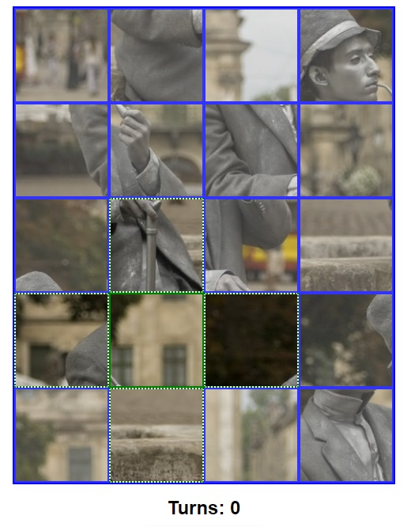

It is the main window of the game. A box that contains a picture 
divided into twenty tiles arranged in four columns and five rows. The tiles can be swapped 
only with another tile that is located directly in the left or right to the clicked tile and as well above or below it. Hovering over the tiles highlights its neighbouring tiles that 
our tile can be swapped with.

The game uses Drag and Drop functionality to click selected tile to drag it and move it over its neighbouring tile to drop it.

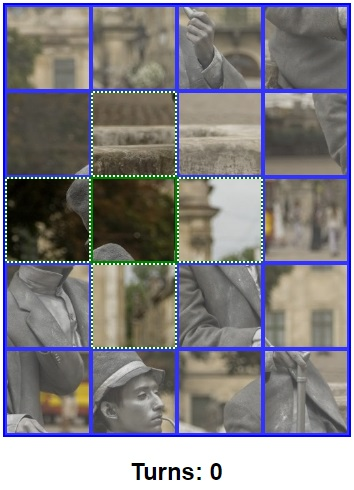
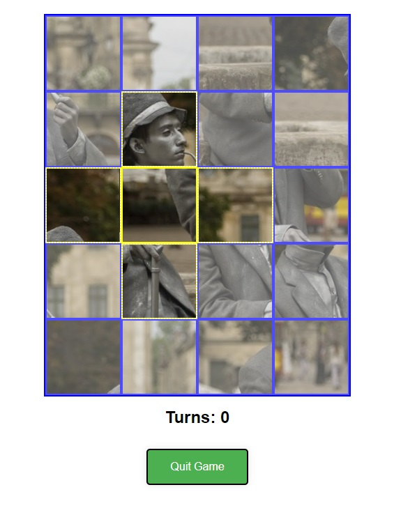

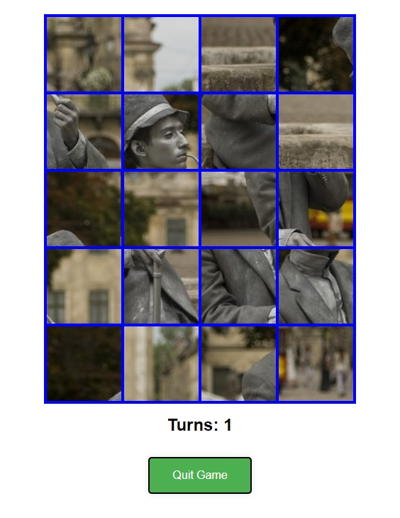


  * **Start New Game/Quit Game** Clicking this button will result with arranging the tiles in random order, the Turns counter is set to zero and the game starts. Thanks to the use of toggle button function the Start New Game button changes its functionality to Quit Game and allows to quit current game and put the pieces into the starting position.

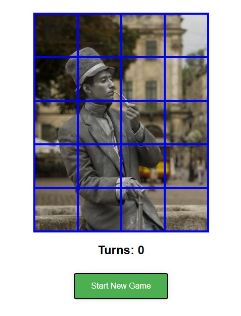
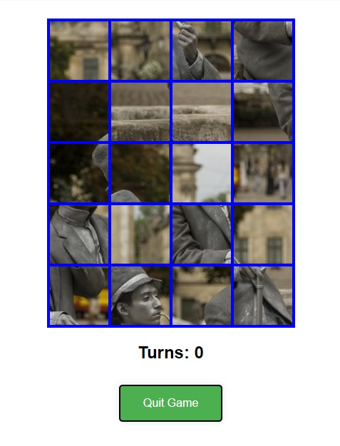

  * **Turns counter** Turns Counter display how many movements have been made so far. The number increases everytime we make a swap.

  * **Upload Your Own Image (New Feature)** A major new feature in Version 2 allows users to upload their own image and instantly transform it into a playable puzzle.

  **How It Works:**
1. Click Upload Image
2. A modal popup window appears
3. Select an image file from your device
4. Click Upload & Split
5. The server:
  - Processes the image
  - Splits it into 20 equal tiles (5 rows × 4 columns)
  - Stores the pieces
  - Reloads the board with the new image

**Upload Popup Window**
The upload form appears inside a modal popup for improved UI experience.

**Features:**
- Clean overlay design
- Cancel button to close without uploading
- Loading state while image is being processed
- Automatic board refresh after successful upload

**This feature is powered by:**
- Node.js backend
- Express server
- Multer (file uploads)
- Sharp (image processing & slicing)

The image is processed server-side and dynamically loaded into the game board.


---

## Collecting Tokens

To receive a reward in the form of NFT Tokens, collect at least 100 points.

To earn points, you must solve the puzzle. The faster you do it (fewer moves), the more points you earn.

Until you have collected the required number of points, the "Claim NFT Reward" button is disabled.

## Claiming Reward

When user clicks Claim:
1. Check balance ≥ threshold (e.g. 100)
2. Ask for wallet address (MetaMask)
3. Call smart contract
4. Mint NFT
5. Reduce backend balance


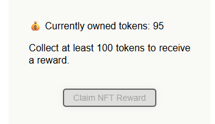

Once you have collected 100 or more points, you can click the button.

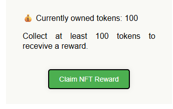

Enter your wallet address


### Connecting Wallet

If MetaMask is connected:
 - autofill input
 - disable manual editing
 - user just clicks "Claim"

If NOT connected:
 - user can type address manually

**MetaMask integration**

Add some photos.

**Manual wallet input**

This function is to be removed.

### Minting NFT's

**1. User clicks "Claim"**

**2. Frontend sends request (wallet address)**

**3. Backend validates tokens**

**4. Backend calls smart contract**

**5. NFT minted to wallet**

**6. Transaction hash returned**

**7. Frontend shows success**

### Smart Contract Implementation in Remix

For this project, I used the Polygon Amoy blockchain network. This is Polygon's testnet, allowing developers to deploy, test, and optimize smart contracts without incurring gas fees on the mainnet.

To use the Amoy free testnet, make sure you have enough Polygon tokens in your connected wallet. If you don't have any tokens, you can claim a free amount [here](https://faucet.polygon.technology/).

#### Remix Ide

Go to [Remix Ide](https://remix.ethereum.org/)

- Deploy & Run Transaction section

<!-- 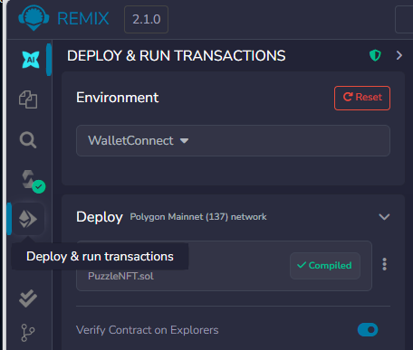 -->

- Click **Environment** to Connect your Wallet.

<!-- 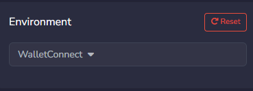 -->

- Select 'Connect Wallet' from drop-box

<!-- 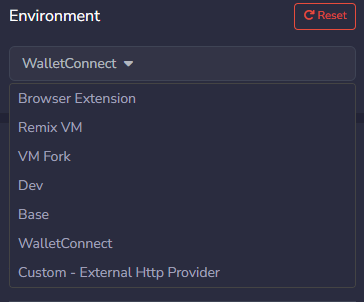 -->

- Choose your wallet.

<!-- 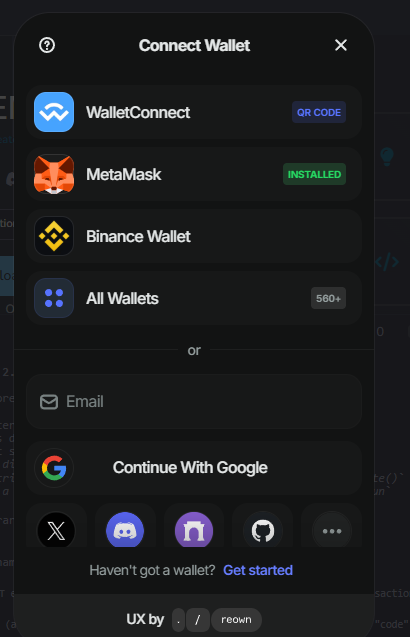 -->

- Connect

<!-- 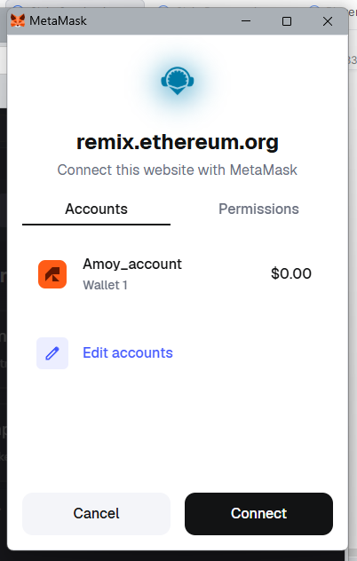 -->

Alternatively if you have you MetaMask browser extention already installed:
1. Open Remix Ide
2. Go to Deploy & Run Transaction tab.
3. From the **Environment** drop-down select *Browser Extension* ( or Injected Provider in older versions), and select *MetaMask*.
4. In your Metamask, switch network to Polygon Amoy
5. Make sure you have some test POL tokens. If you don't, get them from [here](https://faucet.polygon.technology/)
6. Ensure your MetaMask is connected to Amoy Network

  

If the displayed network is different than Amoy, disconnect your wallet an connect it again:
  * Go to your MetaMask
  * Go to settings / Permissions / Sites
  * Find remix.ethereum connection
  * Disconnect wallet
  * Refresh Remix with Alt+F5.
  * Return to step 3. and connect wallet again.

7. Deploy

#### Deploy Contract

- Create a new  *.sol* file, and paste [Smart Contract](codesnippets.md#nft-smart-contract-erc-721) 

- In the Deploy & Run Transaction tab go to Deploy section.
- Click Compile and Deploy. *Assuming your Metamsk Wallet is already connected. If it's not, go to section* 

#### Get abi

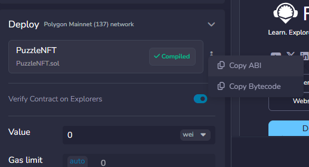


### Claim NFT Reward in the game.


---

## Database

The application uses a *relational database* (PostgreSQL) to store game results, player progress, and reward data. The database is managed using *Flyway* migrations to ensure consistent schema evolution.

### Tables Overview

1. **game_result**

Stores the history of all completed puzzle games.

Fields:

 - id (PK) – Unique identifier for each game result
 - username – Name entered by the player after completing the puzzle
 - moves – Number of turns taken to solve the puzzle
 - reward – Tokens awarded for this game (based on performance)
 - session_id – Identifier linking the result to a specific player session
 - created_at – Timestamp of when the game was completed

Usage:

Used to build the Leaderboard (Top 10 best scores)
Stores full gameplay history for analytics and tracking
Links results to a player via session_id

2. **player_wallet**

Stores the current token balance for each player.

Fields:

 - session_id (PK) – Unique identifier for a player (stored in browser localStorage)
 - token_balance – Total accumulated tokens

Usage:

Tracks player’s total rewards across multiple games
Used to determine if a player is eligible to claim NFT rewards
Updated after each completed game and after each claim

### Relationships
One session_id → Many game_result records
One session_id → One player_wallet record

Player (session_id)

   ├── Game Results (history of plays)

   └── Wallet (current token balance)

---

### Data Flow

1. **Game Completion**
- Frontend sends username, moves, and session_id
- Backend calculates reward and saves a record in game_result
- Player's balance in player_wallet is updated

2. **Leaderboard**
- Backend queries top results from game_result
- Returns best scores to frontend

3. **Reward Claim**
- Player submits a wallet address
- Backend verifies token_balance
- If eligible:
    - Tokens are deducted from player_wallet
    - (Future) NFT is minted to the provided wallet

### Design Notes
- session_id acts as a lightweight player identifier (no authentication required)
- Separation of game history (game_result) and state (player_wallet) ensures clean architecture
- The structure is designed to be easily extendable for:
User accounts
  - Blockchain wallet integration (e.g. MetaMask)
  - NFT minting logic

## Future Features
  - Keyboard control function. Keyboard arrow keys to be used to swap the tiles.
  - Adding your own images to the board that could be split into tiles and used in the game.
  - Mobile devices compatibility. At the moment the game is not working on devices used touch screens. Our future feature would be to implement such a functionality.
  - Add confirm popup box to make sure that the player really wants to quit the current game.
  - Improve the vertical positioning of the game.

---

## Technologies used:
  - Javascript - High-level programming language.
  - Node.js – Backend server
  - Express – Server framework
  - Multer – Image upload handling
  - Sharp – Image processing and splitting
  - HTML5 - Markup language used to make webpages.
  - CSS3 - A language used to style HTML and XHTML documents presentations in web development.
  - Gitpod - Online integrated development environment.
  - GitHub - Version control service used for storing and sharing development projects.
  - Drag and Drop - Functionality that allows to select a virtual object by "grapping" it and "dragging" it to a different location or onto another virtual object
  - Local Storage - Used for storing data such as the game results in the browsers memory.
  - Render – Cloud hosting and deployment.
  - Remix Ide - Browser-based development environment for writing, testing, and deploying Ethereum smart contracts using Solidity.
  - Metamask - crypto wallet.
  - Remix ide - Open-source, browser-based development environment for writing, testing, and deploying Ethereum smart contracts using Solidity.
  - Solidity - High-level, statically-typed programming language specifically designed for writing smart contracts on the Ethereum blockchain.
  - Polygon Amoy - A Polygon testnet which allows developers to deploy, test and optimize their smart contracts without incurring gas fees on the mainet.

---

## Testing
Every page in this project was validation tested and it is responsive for every type of devices from desktop computers to mobile phone screen.
More details about tesings are available in the separate testing section [here](testing.md) or in the dedicated file testing.md

---


## Deployment

The site was deployed using [Render](https://render.com/): 
  
Deployment process:
1. Push project to GitHub
2. Connect repository to Render
3. Set build/start command
4. Deploy automatically from main branch

Live link [here](https://swap-puzzle-game-2.onrender.com)

### Local Deployment

In order to make a local copy of this project, you can clone it. In your IDE Terminal, type the following command to clone my repository:

- `git clone https://github.com/TomaszWoloszyn983/swap-puzzle-game.git`

Alternatively, if using Gitpod, you can click below to create your own workspace using this repository.

[](https://gitpod.io/#https://github.com/TomaszWoloszyn983/swap-puzzle-game)

To run the project locally in you computer (using for example VSC) install [Node.js](https://nodejs.org/en/download), and type: ***node server.js*** in your Ide command line. 
 
---

## References and Credits:
Drag and Drop swap puzzle: https://www.youtube.com/watch?v=S6GNtMGNcUE&t=583s

Grid Layout: https://www.youtube.com/watch?v=68O6eOGAGqA&t=395s

Local Storage: https://www.youtube.com/watch?v=YL1F4dCUlLc&t=1189s
               https://www.youtube.com/watch?v=rVyTjFofok0

Modal popup windows: https://www.youtube.com/watch?v=XH5OW46yO8I

A simple tutorial how to display a timing out text: https://www.youtube.com/watch?v=wK0HgL-UTgY

Stack Overflow: https://stackoverflow.com/

## Credits:
I would like to especially thank to Tim Nelson from Code Institute for his great support.
