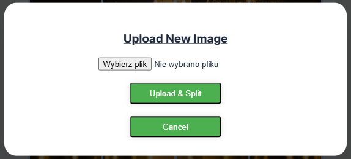
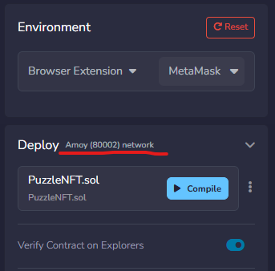

# Tile Swap Puzzle.

## Live Application

Link to the Swap Puzzle Game v2 [Here](https://swap-puzzle-game-2.onrender.com)

## Project Overview 


Tile Swap Puzzle is a full-stack web application that allows users to play a drag-and-drop tile puzzle game and dynamically generate new puzzles by uploading their own images.

The game challenges players to reconstruct an image from shuffled puzzle pieces. Players earn in-game points (tokens) based on their performance — the fewer moves and less time required to solve the puzzle, the higher the reward. After collecting at least 100 tokens, players can exchange them for NFT rewards minted on the blockchain.

The application evolved from a simple front-end puzzle game into a production-ready full-stack project featuring:
- Server-side image processing and dynamic puzzle generation
- User-uploaded image handling
- Dynamic asset generation
- Cloud deployment
- Persistent client-side ranking and score tracking
- Modal-based UI architecture
- Blockchain integration with NFT reward minting
- MetaMask wallet connectivity
- Smart contract interaction using ethers.js
- ERC-721 NFT minting on the Polygon Amoy test network

The NFT reward system integrates Web3 technologies into the game experience. When players claim a reward, the application connects to the user’s MetaMask wallet, interacts with a deployed Solidity smart contract, and mints a unique ERC-721 NFT directly to the player’s wallet using blockchain transactions on the Polygon network.

The project demonstrates practical experience with:
- JavaScript frontend development
- Java and Spring framework backend development
- Asynchronous programming
- REST-style client-server communication
- Smart contract integration and blockchain interaction
- Wallet authentication and transaction signing
- File system management
- Cloud deployment workflows
- Production debugging and troubleshooting across both Web2 and Web3 environments

This project combines traditional full-stack application development with modern blockchain technologies, demonstrating the integration of decentralized systems into an interactive web application experience.

---

## Content

Project contains the following sections:

- [Architecture](#architecture)
- [Features](#features)
- [Rules](#rules)
- [Upload Image](#upload-your-own-image)
- [Tokens and Points](#points-tokens-and-rewards)
- [Metamask Integration](#metamask-integration)
- [Smart Contract Implementation](#smart-contract-implementation-in-remix)
- [Received Nft token](#received-nft)
- [Database](#database)
- [Data Flow](#data-flow)
- [Future Features](#future-features)
- [Technologies Used](#technologies-used)
- [Testing](#testing)
- [Deployment](#deployment)
- [References and Credits](#references-and-credits)

---
## Architecture

#### The application consists of five main components

```
Frontend (game)
        ↓
Spring Boot backend
        ↓
PostgreSQL (wallet balance)
        ↓
CLAIM Button
        ↓
Blockchain (NFT mint)
```

* **The frontend** - is responsible for the user interface, i.e., the game's operation.

* **The backend** - manages the business logic.

* **The database** - stores information such as the high score ranking and the number of points earned by the player.

* **Claim Button** - initiates the process of receiving a reward in the form of an NFT token.

* **Blockchain** - manages the process of creating an NFT token and assigning ownership of the acquired token to the player.

---

## Features

### **Swap Puzzle Game** 

#### Rules

1. Click the Start Game button.

2. Click and hold a tile with your mouse.
Slide the tile towards an adjacent tile to swap them. This creates a picture from the shuffled tiles.

3. You will receive points for completing the picture depending on how many moves you make. The fewer moves you make, the more points you receive.

4. After earning a certain number of points, you can claim a reward in the form of a test NFT token.

5. To claim your reward, click the "Claim NFT Reward" button, which activates after earning the required number of points.
*At least 100 points are currently required to qualify for the reward.*

6. Enter your MetaMask cryptocurrency wallet address and claim your reward in the form of an NFT token on the Polygon Amoy network.
*You may need to have a minimum number of Pol tokens in your wallet to pay for the transaction*.


#### Page features

- **Game Main Board** 


It is the main window of the game. A box that contains a picture 
divided into twenty tiles arranged in four columns and five rows. The tiles can be swapped 
only with another tile that is located directly in the left or right to the clicked tile and as well above or below it. Hovering over the tiles highlights its neighbouring tiles that 
our tile can be swapped with.

The game uses Drag and Drop functionality to click selected tile to drag it and move it over its neighbouring tile to drop it.


* **Start New Game/Quit Game** Clicking this button will result with arranging the tiles in random order, the Turns counter is set to zero and the game starts. Thanks to the use of toggle button function the Start New Game button changes its functionality to Quit Game and allows to quit current game and put the pieces into the starting position.


* **Help** Clicking the Help button displays Popup box that contains more specific information about the rules of the game.


* **About** About section contains some information about version of the program and how to contact the author.

*Content for Help and About sections, as well as content for the left-side panel are defined in separate html files located in public/textContent folder, and they are dynamically added to the index.html template.*

```html
  <!-- Help Popup box -->
  <div class = "popup" id="popup-help"> 
      <div class="overlay"></div>
      <div class="content">
          <!-- Insert help content from textContent/help.html -->
          <div id="helpContent"></div>
          <button type="button" id="closeHelp">Close</button>
      </div>
  </div>
  <!-- About Popup box -->
  <div class = "popup" id="popup-about"> 
      <div class="overlay"></div>
      <div class="content">
          <!-- Insert help content from textContent/about.html -->
          <div id="aboutContent"></div>
          <button type="button" id="closeAbout">Close</button>
      </div>
  </div>
```

More details [here](codesnippets.md#display-text-content-from-other-html-file)


* **Side bars** 
* **Greeting bar** Displays greeting and brief introduction to the game and its rules.
* **Leaderboard** List of the best results that were achived by players. It is sorted and displayed in ascending order. The data from the list are stored in relational datatable.
 
* **Footer** Contains information about Copyrights. 

* **Turns counter** Turns Counter display how many movements have been made so far. The number increases everytime we make a swap.

---

### Upload Your Own Image
A major new feature in Version 2. It allows users to upload their own image and instantly transform it into a playable puzzle.

  **How It Works:**
1. Click 'Upload Image' button.
2. A modal popup window appears.
3. Select an image file from your device.
4. Click 'Upload & Split' button.
5. Then the server:
    - Processes the image.
    - Splits it into 20 equal tiles (5 rows × 4 columns).
    - Stores the pieces.
    - Reloads the board with the new image.



**Upload Popup Window**
The upload form appears inside a modal popup for improved UI experience.

**Features:**
- Clean overlay design
- Cancel button to close without uploading
- Loading state while image is being processed
- Automatic board refresh after successful upload

**This feature is powered by:**
- Node.js backend
- Express server
- Multer (file uploads)
- Sharp (image processing & slicing)

The image is processed server-side and dynamically loaded into the game board.

Added images are stored in cache on the server, they are not stored on any external storage. An added image is permanently deleted from memory immediately after the next image is added.


  <!-- vvv This must be here by accident vvv -->
<!-- * **Claim Reward popup box**


Pop-up widow code snippet: [Pop-up modal](codesnippets.md#get-reward-popup-box) -->

---

## Points, Tokens and rewards

### Collecting Tokens
To receive a reward in the form of NFT Tokens, collect at least 100 points.
To earn points, you must solve the puzzle. The faster you do it (fewer moves), the more points you earn.
Until you have collected the required number of points, the "Claim NFT Reward" button is disabled.

### Minting NFT's
1. User clicks "Claim"
2. Frontend sends request (wallet address)
3. Backend validates tokens
4. Backend calls smart contract
5. NFT minted to wallet
6. Transaction hash returned
7. Frontend shows success

### Claiming Reward
When user clicks Claim, the application:
1. Checks if balance is equaL or higher than the threshold (e.g. 100)
2. Asks for wallet address (MetaMask)
3. Calls smart contract
4. Mints NFT
5. Reduces backend balance by the threshold.


Once you have collected 100 or more points, you can click the button.


Enter your wallet address


### Connecting Wallet
If MetaMask is connected:
 - autofill input
 - disable manual editing
 - user just clicks "Claim"

If NOT connected:
 - user can type address manually

### **MetaMask integration**
MetaMask acts as:
  * wallet
  * blockchain identity
  * transaction signer

It allows the user to:
  * connect wallet
  * approve transactions
  * sign blockchain operations securely

Your app NEVER gets the user’s private key.

MetaMask signs transactions safely.

**Integration**
```js
  import { ethers } from "https://cdn.jsdelivr.net/npm/ethers@5.7.2/dist/ethers.esm.min.js";

  window.ethereum

  if (!window.ethereum) {
    alert("MetaMask not detected");
  }
```
To integrate the application with the Blockchain network, I used Provider class.
A provider is the bridge between Frontend Application and Blockchain Network

It allows reading blockchain data, such as: 
  * Signer - used for approval blockchain transactions
  * Network/chain Id - returns the blockchain Id, which can be used for network veryfication.

```js
  const provider = new ethers.providers.Web3Provider(window.ethereum);
  const signer = provider.getSigner();

  const network = await provider.getNetwork();
  console.log(network.chainId);

  const contract = new ethers.Contract(contractAddress, abi, signer);

```

#### **Contract** 
is a connection to the smart contract located at the contractAddess, using abi description, and let this wallet signer to authorize transactions. 

You can get your **contractAddress** copied from Remix -> [Deployed Contract](#deploy-contract).

To verify if the Contract Address is correct go to [PolygonScan](https://amoy.polygonscan.com/)

#### **Transaction** 
is a signed instruction sent to the blockchain
  that changes blockchain state.

#### **State** 
is an information stored permanently on blockchain. 
  * NFT ownership
  * balances
  * token Id's
  * contract data

### **abi**
abi - *Application Binary Interface* describes:
  * available functions - without abi frontend does not know what functions exist and how to call them.
  * function parameters - what arguments the functions require.
  * return values
  * events

You can copy ABI from Remix.


---

### Smart Contract Implementation in Remix

For this project, I used the Polygon Amoy blockchain network. This is Polygon's testnet, allowing developers to deploy, test, and optimize smart contracts without incurring gas fees on the mainnet.

To use the Amoy free testnet, make sure you have enough Polygon tokens in your connected wallet. If you don't have any tokens, you can claim a free amount [here](https://faucet.polygon.technology/).

### Remix Ide

Go to [Remix Ide](https://remix.ethereum.org/)

**Before you start install MetaMask browser extention in your browser**
1. Open Remix Ide
2. Go to Deploy & Run Transaction tab.
3. From the **Environment** drop-down select *Browser Extension* ( or Injected Provider in older versions), and select *MetaMask*.
4. In your Metamask, switch network to Polygon Amoy
5. Make sure you have some test POL tokens. If you don't, get them from [here](https://faucet.polygon.technology/)
6. Ensure your MetaMask is connected to Amoy Network

  

**If the displayed network is different than Amoy, disconnect your wallet an connect it again:**
  * Go to your MetaMask
  * Go to settings / Permissions / Sites
  * Find *remix.ethereum* connection
  * Disconnect wallet
  * Refresh Remix with Alt+F5.
  * Return to step 3. and connect wallet again.

#### Deploy Contract

1. Create a new  *.sol* file, and paste [Smart Contract](codesnippets.md#nft-smart-contract-erc-721) 

2. In the Deploy & Run Transaction tab go to Deploy section.
3. Click Compile and Deploy. *Assuming your Metamsk Wallet is already connected. If it's not, go to section*  [Connect Wallet](#remix-ide)
4. After the Deployment, **Copy and Save** (important!):
    * Contract Address
    * Network Name
    * abi

---

### Received Nft

**Important note!**
What the user receives at this stage is NOT the Nft itself. It is the Nft metadata file working on the Polygon Amoy Testnet. They do not have any market value. 
How ever you can verify ....

The aim of the project is to demonstrate a functional blockchain integration, not a profuction-ready NFT ecosystem.

```js
{
  "name": "Puzzle Reward",
  "description": "Awarded for solving the puzzle",
  "image": "https://raw.githubusercontent.com/ethereum/ethereum-org-website/dev/src/data/nft-metadata.json"
}
```

---

## Database

The application uses a *relational database* (PostgreSQL) to store game results, player progress, and reward data. The database is managed using *Flyway* migrations to ensure consistent schema evolution.

### Tables Overview

1. **game_result**

Stores the history of all completed puzzle games.

Fields:

 - id (PK) – Unique identifier for each game result
 - username – Name entered by the player after completing the puzzle
 - moves – Number of turns taken to solve the puzzle
 - reward – Tokens awarded for this game (based on performance)
 - session_id – Identifier linking the result to a specific player session
 - created_at – Timestamp of when the game was completed

Usage:

Used to build the Leaderboard (Top 10 best scores)
Stores full gameplay history for analytics and tracking
Links results to a player via session_id

2. **player_wallet**

Stores the current token balance for each player.

Fields:

 - session_id (PK) – Unique identifier for a player (stored in browser localStorage)
 - token_balance – Total accumulated tokens

Usage:

Tracks player’s total rewards across multiple games
Used to determine if a player is eligible to claim NFT rewards
Updated after each completed game and after each claim

### Relationships
One session_id → Many game_result records
One session_id → One player_wallet record

Player (session_id)

   ├── Game Results (history of plays)

   └── Wallet (current token balance)

---

### Data Flow

1. **Game Completion**
- Frontend sends username, moves, and session_id
- Backend calculates reward and saves a record in game_result
- Player's balance in player_wallet is updated

2. **Leaderboard**
- Backend queries top results from game_result
- Returns best scores to frontend

3. **Reward Claim**
- Player submits a wallet address
- Backend verifies token_balance
- If eligible:
    - Tokens are deducted from player_wallet
    - (Future) NFT is minted to the provided wallet

### Design Notes
- session_id acts as a lightweight player identifier (no authentication required)
- Separation of game history (game_result) and state (player_wallet) ensures clean architecture
- The structure is designed to be easily extendable for:
User accounts
  - Blockchain wallet integration (e.g. MetaMask)
  - NFT minting logic

---

## Future Features
  - Adding the ability to authenticate and create user accounts.
  - Introducing the ability to insert photos in the horizontal position.
  - Keyboard control function. Keyboard arrow keys to be used to swap the tiles.
  - Mobile devices compatibility. At the moment the game is not working on devices used touch screens. Our future feature would be to implement such a functionality.
  - Improve the vertical positioning of the game.

---

## Technologies used:
  - Java - high-level, class-based, object-oriented programming language used in back-end systems, microservices, and web applications.
  - Spring Framework - a powerful, lightweight, and modular Java framework widely used for building scalable, maintainable, and secure enterprise applications.
  - Javascript - high-level, interpreted programming language primarily used to make web pages interactive and dynamic.
  - Node.js – Backend server
  - Express – Server framework
  - Multer – Image upload handling
  - Sharp – Image processing and splitting
  - HTML5 - Markup language used to make webpages.
  - CSS3 - A language used to style HTML and XHTML documents presentations in web development.
  - Gitpod - Online integrated development environment.
  - GitHub - Version control service used for storing and sharing development projects.
  - Drag and Drop - Functionality that allows to select a virtual object by "grapping" it and "dragging" it to a different location or onto another virtual object
  - Local Storage - Used for storing data such as the game results in the browsers memory.
  - Supabase - offers a PostgreSQL database, built-in authentication, real-time subscriptions, storage solutions.
  - H2 Database -  open-source, Java-based relational database designed for speed, portability, and ease of integration.
  - Render – Cloud hosting and deployment.
  - Metamask -  is a free, open-source software wallet that primarily supports Ethereum and ERC-20 tokens. MetaMask is available as a browser extension for Chrome, Firefox, Brave, and Edge, as well as a mobile app for iOS and Android devices.
  - Remix ide - Open-source, browser-based development environment for writing, testing, and deploying Ethereum smart contracts using Solidity.
  - Solidity - High-level, statically-typed programming language specifically designed for writing smart contracts on the Ethereum blockchain.
  - Polygon Amoy - A Polygon testnet which allows developers to deploy, test and optimize their smart contracts without incurring gas fees on the mainet.

---

## Testing
Every page in this project was validation tested and it is responsive for every type of devices from desktop computers to mobile phone screen.
More details about tesings are available in the separate testing section [here](testing.md) or in the dedicated file testing.md

---


## Deployment

The site was deployed using [Render](https://render.com/): 
  
Deployment process:
1. Push project to GitHub
2. Connect repository to Render
3. Set build/start command
4. Deploy automatically from main branch

Live link [here](https://swap-puzzle-game-2.onrender.com)

### Local Deployment

In order to make a local copy of this project, you can clone it. In your IDE Terminal, type the following command to clone my repository:

- `git clone https://github.com/TomaszWoloszyn983/swap-puzzle-game.git`

Alternatively, if using Gitpod, you can click below to create your own workspace using this repository.

[](https://gitpod.io/#https://github.com/TomaszWoloszyn983/swap-puzzle-game)

To run the project locally in you computer (using for example VSC) install [Node.js](https://nodejs.org/en/download), and type: ***node server.js*** in your Ide command line. 
 
---

## References and Credits:
Drag and Drop swap puzzle: https://www.youtube.com/watch?v=S6GNtMGNcUE&t=583s

Grid Layout: https://www.youtube.com/watch?v=68O6eOGAGqA&t=395s

Local Storage: https://www.youtube.com/watch?v=YL1F4dCUlLc&t=1189s
               https://www.youtube.com/watch?v=rVyTjFofok0

Modal popup windows: https://www.youtube.com/watch?v=XH5OW46yO8I

A simple tutorial how to display a timing out text: https://www.youtube.com/watch?v=wK0HgL-UTgY

Stack Overflow: https://stackoverflow.com/

## Credits:
I would like to especially thank to Tim Nelson from Code Institute for his great support.
