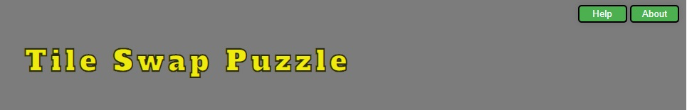
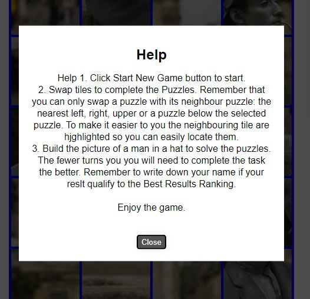
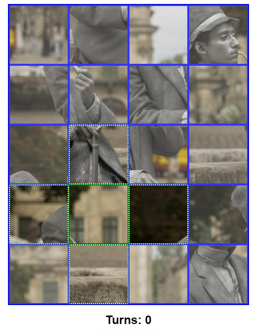
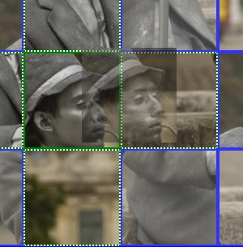
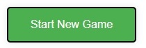
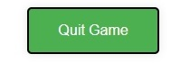

# Tile Swap Puzzle.

## Welcome to my Project! 

The object of the project is a puzzle game. The purpose of the game is to swap tiles
and put the in the correct order. Displaying tiles in the right order will reveal the 
picture and will complete the game.
There is also a turns counter below the main game board that counts how many movements
did the player had to make to complete the task. If the number of turns is good enough 
the player name can be added and displayed in the Best Results list.

## Features
The project includes only one main page, divided into three main sections:
- **Header** 
Where the name of the project is displayed.
Header section also encloses the navigation bar that constains two buttons.

  * **Help** Clicking the Help button displays Popup box that contains more specific 
    information about working the application. 

  * **About** About section contains some information about version of the program and
    contact with the author.

- **Game Main Board** 

It is the main window of the game. A box that contains a picture 
divided into twenty tiles arranged in four columns and five rows. The tiles can be swapped 
only with another tile that is located directly in the left or right to the clicked tile and as well above or below it. Hovering over the tiles highlights its neighbouring tiles that 
our tile can be swapped with.

The game uses Drag and Drop functionality to click selected tile to drag it and move it over its neighbouring tile to drop it.

  * **Start New Game/Quit Game** Clicking this button is causing that the tiles are arranged in the random order, the Turns counter is set to zero and the game starts. Thanks to the use of toggle button function the Start New Game button changes its functionality to Quit Game and allows to quit current game and put the pieces into the starting position.

  * **Turns counter** Turns Counter display how many movements the player has to make to complete the puzzles. The number increase everytime we make a correct swap.

- **Side bars** 
  * **Greeting bar** Displays greeting and brief introduction to the game and its rules.
  * **Best Results** List of the best results that were achived by players. It is sorted and displayed in ascending order. The data from the list are stores in the Local Storage and they as restored after each entry to the game.
 
 
- **Footer** Contains information about Copyrights. 

## Future Features
- Keyboard control function. So the game would be able to control with keyboard arrow keys. 
- Adding your own images to the board that could be split into tiles and used in the game.
- Mobile devices compatibility. At the moment the game is not working on devices used touch screens. Our future feature would be to implement such a functionality.

## Technologies used:
  - Javascript - High-level programming language.
  - HTML5 - Markup language used to make webpages.
  - CSS3 - A language used to style HTML and XHTML documents presentations in web development.
  - Gitpod - Online integrated development environment.
  - GitHub - Version control service used for storing and sharing projects.
  - Drag and Drop - Functionality that allows to select a virtual object by "grapping" it and "dragging" it to a different location or onto another virtual object

## Testing
Every page in this project was validation tested and it is responsive for every type of devices from desktop computers to mobile phone screen.
More details about tesings are available in the separate testing section [here](testing.md) or in the dedicated directory documentation/TESTING.md

## Deployment

The site was deployed to GitHub pages. The steps to deploy are as follows: 
  - In the [GitHub repository](https://github.com/TomaszWoloszyn983/swap-puzzle-game), navigate to the Settings tab 
  - From the source section drop-down menu, select the **Main** Branch, then click "Save".
  - The page will be automatically refreshed with a detailed ribbon display to indicate the successful deployment.

The live link can be found [here](https://tomaszwoloszyn983.github.io/swap-puzzle-game/)

### Local Deployment

In order to make a local copy of this project, you can clone it. In your IDE Terminal, type the following command to clone my repository:

- `git clone https://github.com/TomaszWoloszyn983/swap-puzzle-game.git`

Alternatively, if using Gitpod, you can click below to create your own workspace using this repository.

## References and Credits:
Drag and Drop swap puzzle: https://www.youtube.com/watch?v=S6GNtMGNcUE&t=583s
Grid Layout: https://www.youtube.com/watch?v=68O6eOGAGqA&t=395s
Local Storage: https://www.youtube.com/watch?v=YL1F4dCUlLc&t=1189s
               https://www.youtube.com/watch?v=rVyTjFofok0
Modal popup windows: https://www.youtube.com/watch?v=XH5OW46yO8I
Stack Overflow: https://stackoverflow.com/

## Credits:
<!-- Many thanks to Tim Nelson from Code Institute for great support, many  -->
