**Responsiveness**
- The project was responsive tested on https://ui.dev/amiresponsive and it is responsive for every type of devices such as desktop computers, laptops, tablets and smart phones.

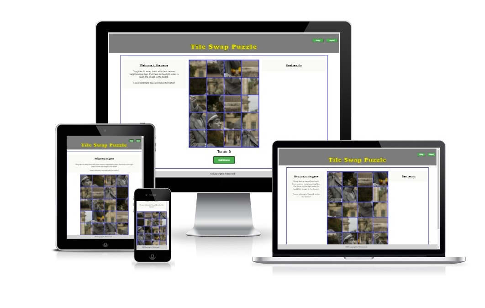

## **Validator Testing**
- HTML
    * No errors were detected when passing through the [W3C validator](https://validator.w3.org/nu/).
    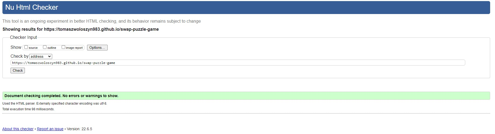.
    * Link to the validation testing for my Html file:
    https://validator.w3.org/nu/?doc=https%3A%2F%2Ftomaszwoloszyn983.github.io%2Fswap-puzzle-game

- CSS
    * No errors were detected when passing through the [jigsaw.w3 validator](https://jigsaw.w3.org/css-validator). 

         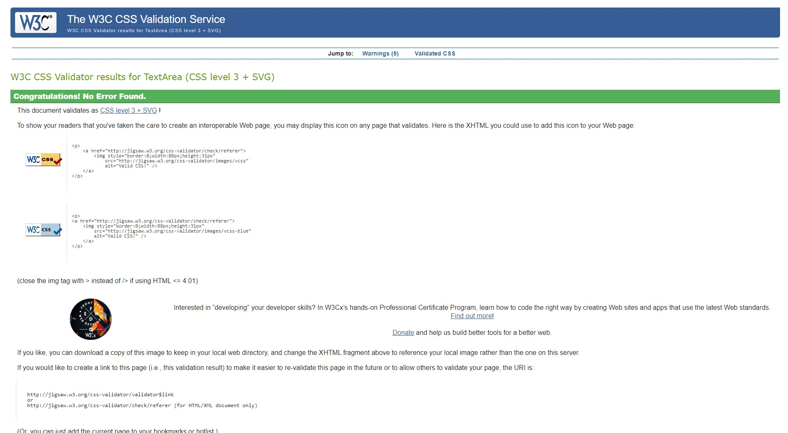
    
    Link to the test
         https://jigsaw.w3.org/css-validator/validator?uri=https%3A%2F%2Ftomaszwoloszyn983.github.io%2Fswap-puzzle-game

- JAVASCRIPT
    * No errors were detected when passing through the [jshint](https://jshint.com/) validator.

    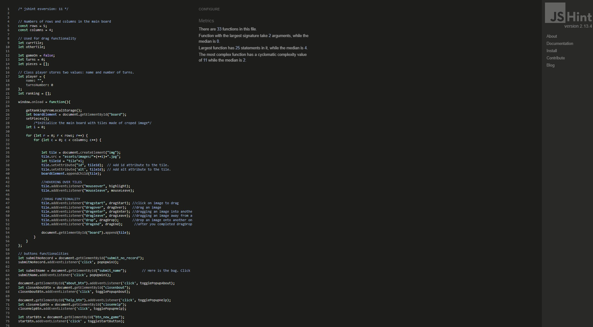

## **Browsers compatibility**
- The Web Page is compatibile with every tested browser, such as:
    * Google Chrome:

         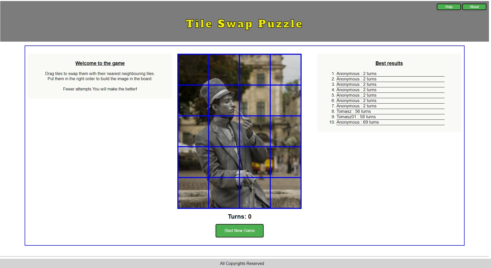

    * Microsoft Edge: 
    
       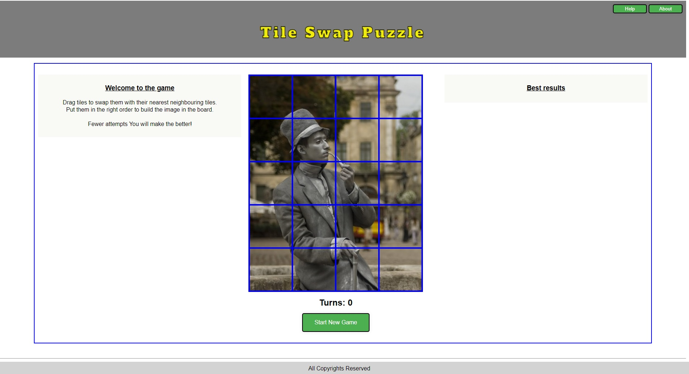

    * Avast Browser: 

        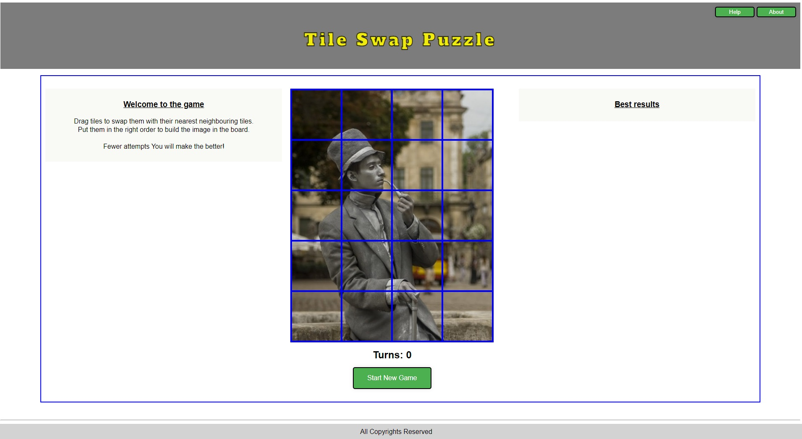

    * Netbox Browser:

        

## **Lighthouse Inspection reports**
 - There are some issues when the page is opening using Google Chrome browser.

    * 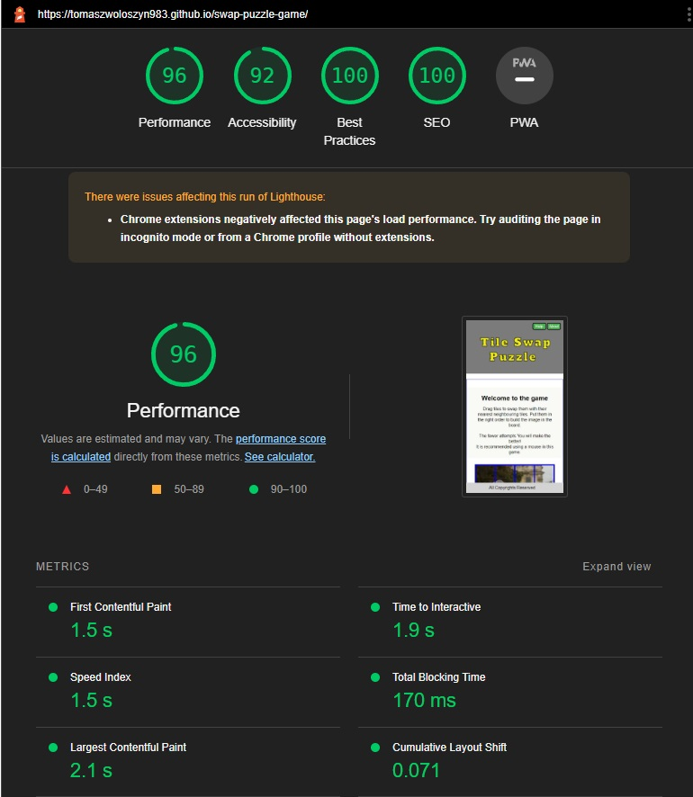

    However inspecting the page in Incognito Mode without any browser extensions shows results as follows

    * 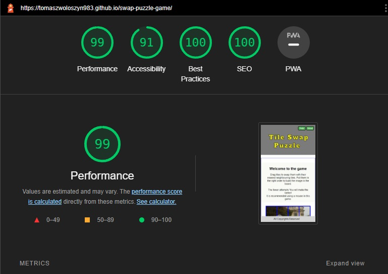

    Making Lighthouse inspections using different browsers show very similar results. 
    
    * 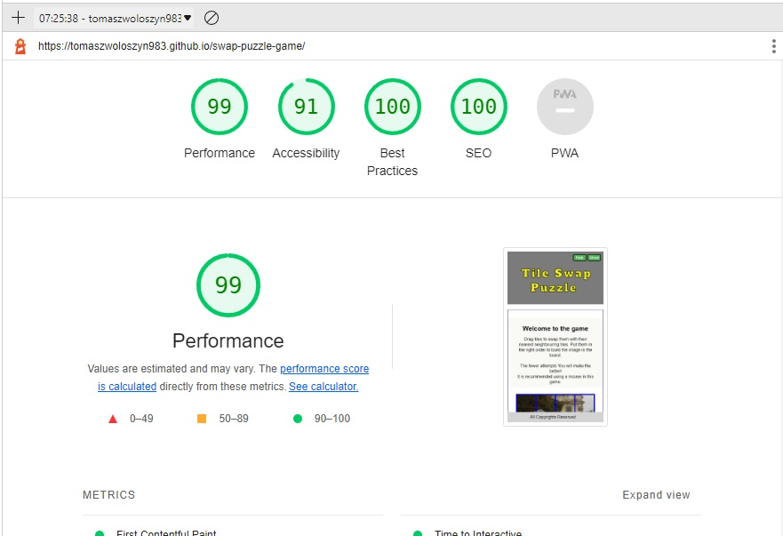

    This is an example of Lighthouse inspection in Microsort Edge browser made using inPrivate mode.

- Although the game is also responsive on every mobile devices as Tablets or Smart Phones, most of the devices using touch screen don't support Drag and Drop functionality, so it is recommended to use a mouse to play this game.

    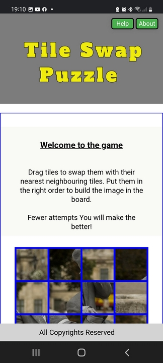
    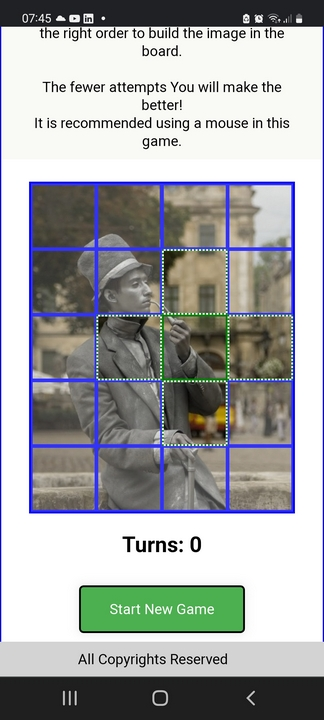
    
    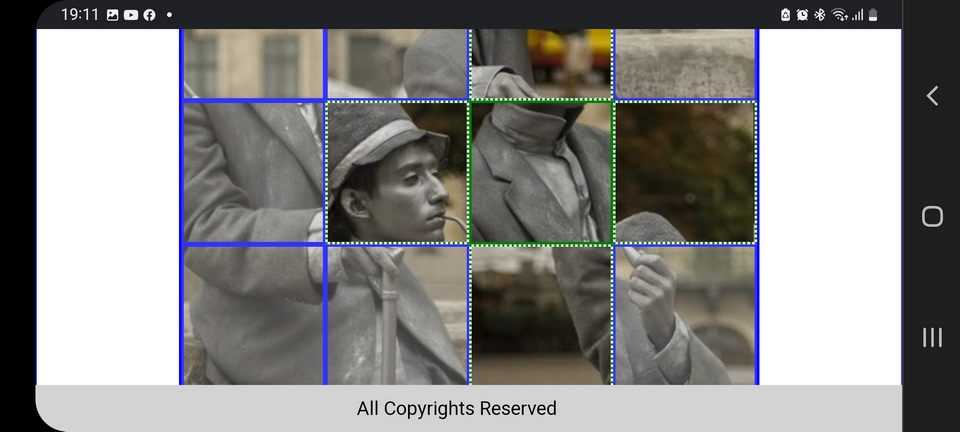

 

## **Unfixed Bugs**
- The main unfixed bug is the lack of support for mobile devices, such as mobile phone using touch screens.